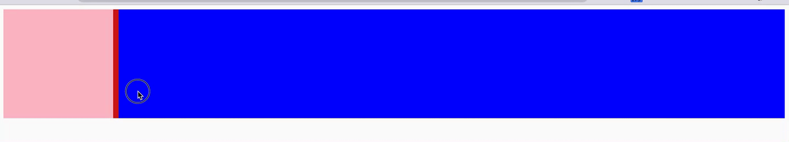

# DragView

一个简单的拖拽实现的div的大小互换


+ 实现上下、左右的的滑动拖拽大小
+ 实现宽高可以固定比例（根据document大小，不是可是窗口的大小）,可以随时直接修改实例的fixed的boolean进行变更是否固定相对document的比例大小
+ 只需要3个div就可以实例化一个demo
  ```js
    new DragView(document.getElementById("center"), {
        direction: "horizontal",
        fixed: true,
        left: document.getElementById("left"),
        right: document.getElementById("right"),
    });
  ```

### 使用
```bash
npm install drag2view
```

```js
// 支持umd、esm
import DragView from 'drag2view'

new DragView(document.getElementById("center"), {
    direction: "horizontal",
    fixed: true,
    left: document.getElementById("left"),
    right: document.getElementById("right"),
});
```

+ options
  + Element  - 第一个参数，拖动的元素
  + options
    | key       | value                                                                   |
    | --------- | ----------------------------------------------------------------------- |
    | direction | "horizontal"可选"vertical"                                              |
    | fixed     | 是否根据body的宽高进行相对页面固定比列的伸缩可缩放区域大小（默认false） |
    | left      | 左侧的元素Element（仅在direction为horizontal的时候必填）                |
    | right     | 右侧的元素Element（仅在direction为horizontal的时候必填）                |
    | top       | 上部的元素Element（仅在direction为vertical的时候必填）                  |
    | bottom    | 下部的元素Element（仅在direction为vertical的时候必填）                  |

